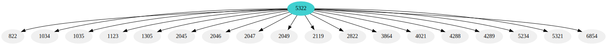
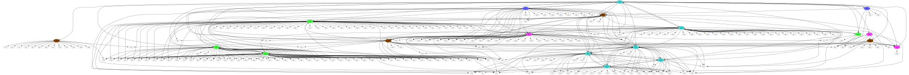

# RFC Graph

<div align="center">
  <a href="https://crates.io/crates/rfc-graph">
    
  </a>
  <a href="https://docs.rs/rfc-graph">
    
  </a>
</div>

How the rfc are referencing each other ?

```rs
let (rfcs_linked, status) = rfc_graph::RfcGraph::get(5322, 3).await;
println!("{rfcs:?} {status:?}");
```

```sh
$> cargo run -- -h
rfc-graph 0.1.1

USAGE:
    rfc-graph [OPTIONS] --root <ROOT>

OPTIONS:
    -h, --help                             Print help information
        --recursion-max <RECURSION_MAX>    Number of recursive iteration max [default: 2]
        --root <ROOT>                      Number of the first rfc page in the graph (root)
    -V, --version                          Print version information
```

Output generated:

* `cache.json` : a `HashMap<i32, Vec<i32>>` with key is the rfc source and values are the rfc referenced
* `input.dot` : a representation of the graph generated following the [dot format](https://graphviz.org/doc/info/lang.html) by [graphviz](https://graphviz.org/)
* `output.svg` : a svg version of the dot graph

```sh
$> cargo run -- --root 5322 --recursion-max 1
```



```sh
$> cargo run -- --root 5322 --recursion-max 2
```



The referencing in the rfcs are exponential, so you **might not** want to run with `--recursion-max 4`

## Color

| Status                            | Color  |
| --------------------------------- | ------ |
| Unknown                           | ⬜     |
| Draft                             | 🟥     |
| Informational                     | 🟧     |
| Experimental                      | 🟨     |
| Best Common Practice              | 🟪     |
| Proposed Standard                 | 🟦     |
| Draft Standard (old designation)  | :cyan: |
| Internet Standard                 | 🟩     |
| Historic                          | ⬛     |
| Obsolete                          | 🟫     |

Leaf node status is unknown as the web scraping is not done for them

## Next Features

I would like to add the following features :

* display the title of the rfc
* improve the graph view (for huge graph readability)
* render the status of the leaf node
