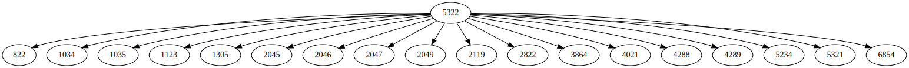
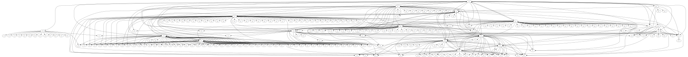

# RFC Graph

How the rfc are referencing each other ?

```sh
$> cargo run -- -h
rfc-graph 0.1.0

USAGE:
    rfc-graph [OPTIONS] --root <ROOT>

OPTIONS:
    -h, --help                             Print help information
        --recursion-max <RECURSION_MAX>    Number of recursive iteration max [default: 2]
        --root <ROOT>                      Number of the first rfc page in the graph (root)
    -V, --version                          Print version information
```

Output generated:

* `cache.json` : a `HashMap<i32, Vec<i32>>` with key is the rfc source and values are the rfc referenced
* `input.dot` : a representation of the graph generated following the [dot format](https://graphviz.org/doc/info/lang.html) by [graphviz](https://graphviz.org/)
* `output.svg` : a svg version of the dot graph

```sh
$> cargo run -- --root 5322 --recursion-max 1
```



```sh
$> cargo run -- --root 5322 --recursion-max 2
```



The referencing in the rfcs are exponential, so you **might not** want to run with `--recursion-max 4`

## Next features

I would like to add the following features :

* display the title of the rfc
* show the status following this legend :

| Status                            | Color                                                          |
| --------------------------------- | -------------------------------------------------------------  |
| Unknown                           | <span class='cplate bgwhite'>&nbsp;&nbsp;&nbsp;&nbsp;</span>   |
| Draft                             | <span class='cplate bgred'>&nbsp;&nbsp;&nbsp;&nbsp;</span>     |
| Informational                     | <span class='cplate bgorange'>&nbsp;&nbsp;&nbsp;&nbsp;</span>  |
| Experimental                      | <span class='cplate bgyellow'>&nbsp;&nbsp;&nbsp;&nbsp;</span>  |
| Best Common Practice              | <span class='cplate bgmagenta'>&nbsp;&nbsp;&nbsp;&nbsp;</span> |
| Proposed Standard                 | <span class='cplate bgblue'>&nbsp;&nbsp;&nbsp;&nbsp;</span>    |
| Draft Standard (old designation)  | <span class='cplate bgcyan'>&nbsp;&nbsp;&nbsp;&nbsp;</span>    |
| Internet Standard                 | <span class='cplate bggreen'>&nbsp;&nbsp;&nbsp;&nbsp;</span>   |
| Historic                          | <span class='cplate bggrey'>&nbsp;&nbsp;&nbsp;&nbsp;</span>    |
| Obsolete                          | <span class='cplate bgbrown'>&nbsp;&nbsp;&nbsp;&nbsp;</span>   |

<style>
.cplate   { font-size: 70%; border: solid grey 1px; }

.bgwhite  { background-color: white; }
.bgred    { background-color: #F44; }
.bggrey   { background-color: #666; }
.bgbrown  { background-color: #840; }
.bgorange { background-color: #FA0; }
.bgyellow { background-color: #EE0; }
.bgmagenta{ background-color: #F4F; }
.bgblue   { background-color: #66F; }
.bgcyan   { background-color: #4DD; }
.bggreen  { background-color: #4F4; }

</style>
